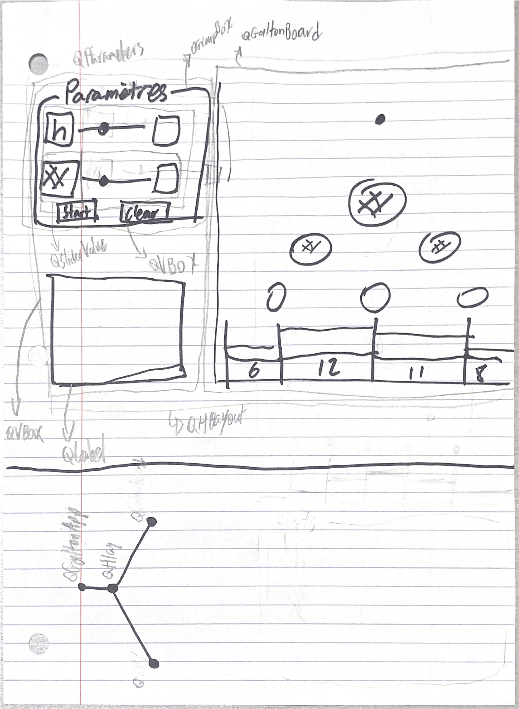

# Projet0_dalton_board

## Introduction

Ce projet consiste à faire une simulation du [Galton Board](https://en.wikipedia.org/wiki/Galton_board).

## Modèle Mathématique

### 1. Système de positionnement

- l'adresse de la cheville est donnée par sa **hauteur**, $a$, et sa **position** dans la rangée, $b$.

- la hauteur, $h$, qui représente la dernière rangée de cheville.
    - donc le bac est considéré comme une rangée de cheville supplémentaire, de hauteur $h + 1$

### 2. Représentation de la trajectoire d'une balle

- Pour $n$ balles et $r$ rangées
- On crée $r$ matrices 1 x $n$, remplie aléatoirement de 0 ou 1.
    - 1 = droite, 0 = gauche
- On crée une matrice pour stocker le nombre de collision de chaque cheville. Chaque nouvel élément de cette matrice représente le compte de la cheville à cet index. Pour retouver une cheville dans cette matrice: 
$$(a(a+1)) /2 + b$$
- On fait une sommation des matrices, on s'arrête à chaque nouvelle matrice pour évaluer les collisions.
- Chaque matrice intermédiaire représente la nouvelle position de chaque bille sur l'arbre.
    - On retrouve ensuite chaque cheville où il y présentement une bille, et on ajoute 1 collision et ce à chaque index, : 
    $$(a(a+1)) /2 + b$$
    Où $a$ = la quantième sommation et $b$ = la valeur à cet index de la matrice intermédiaire. 

## Interface graphique

### Schéma

